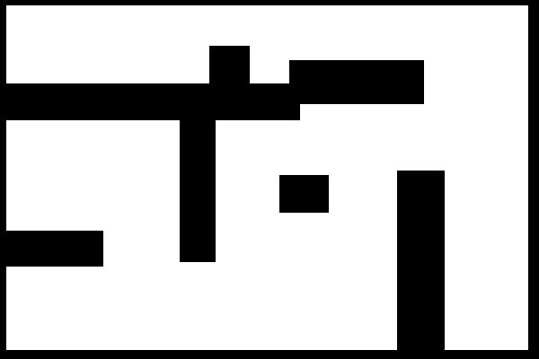
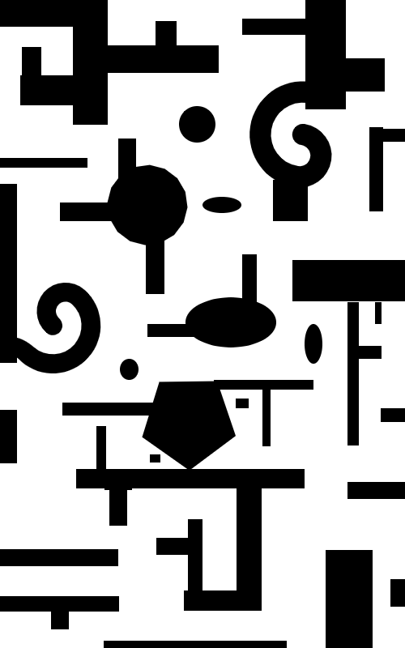

# Treasure AI
An AI that attempts to find a treasure in an OpenAI environment. The AI uses reinforcement learning in two forms: Q-Learning and DQN.

# How To Run
* Q-Learning Method
    python TreasureHunt_QL.py
    Difficulty (simple, easy, medium, or full): (Enter Difficulty of Map)
* DQN Method
    python TreasureHunt_QL.py
    Difficulty (simple, easy, medium, or full): (Enter Difficulty of Map)
## Resources Used
* Pygame and OpenAI Gym
* Q-Learning framework and project organization from [https://github.com/monokim/PyRacing]
* DQN framework from [https://towardsdatascience.com/reinforcement-learning-w-keras-openai-dqns-1eed3a5338c]

## Map Difficulties
* Simple   

* Easy   

* Medium   

* Full(Most Complex)   

